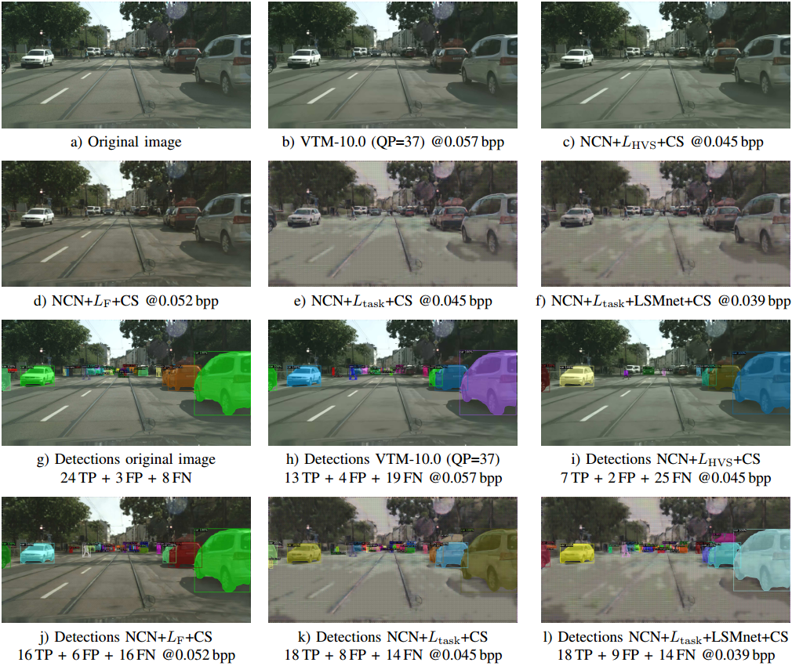

# Boosting Neural Image Compression for Machines Using Latent Space Masking

In our publication [Fischer2022], neural image compression networks have been optimized for reducing the bitrate while maintaining the detection accuracy of a Mask R-CNN instance segemenation network that is applied to the decoded images. This repository now publishes the most relevant models and exemplary inference code to reproduce the coded images. In total the following models can be downloaded from [Link](https://drive.google.com/drive/folders/13j2UdpH5I7H3COqbP7rjjYyUn8HeFjun?usp=sharing):
* **NCN+L_HVS+CS**: Model trained on Cityscapes and HVS loss
* **NCN+L_F+CS**: Model trained on Cityscapes and novel feature-based loss
* **NCN+L_TASK+CS**: Model trained end-to-end on Cityscapes and Mask R-CNN loss
* **NCN+L_TASK+LSMnet+CS**: Model with novel latent space masking network (LSMnet) derived from ResNet trained on Cityscapes

For each method, four models are published trained differently depending on the weighting parameter lambbda.

## Prerequisites
The specification of the used conda environment can be found in the file [environment_ncn_for_m2m.yml](environment_ncn_for_m2m.yml). If the model with LSMnet shall be run, [Detectron2](https://github.com/facebookresearch/detectron2) has to be installed and linked in addition. For the Mask R-CNN model, the weights *R50-FPN, Cityscapes* were taken from the [Detectron2 Model Zoo](https://github.com/facebookresearch/detectron2/blob/main/MODEL_ZOO.md).

## Usage
[encode_image.py](encode_image.py) shows an example for compressing an arbitrary image with the published models. For applying Mask R-CNN to the compressed images, please consider the Detectron2 library with the pre-learned models and [CityscapesScripts](https://github.com/mcordts/cityscapesScripts) for measuring the wAP.

## Literature
If you are using our models please cite the following work:

[Fischer2022] K. Fischer, F. Brand, A. Kaup, "Boosting Neural Image Compression for Machines Using Latent Space Masking," accepted for IEEE Transactions on Circuits and Systems for Video Technology, 2022

